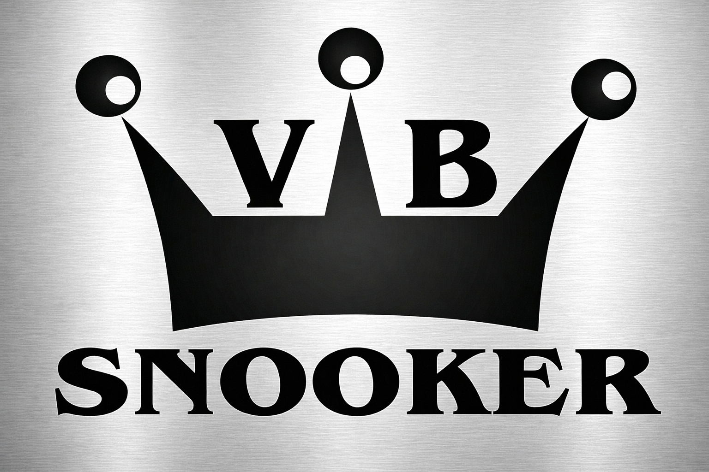

# VB Snooker - Sistema de Emissão de Pedidos

Um sistema web moderno, rápido e intuitivo projetado especificamente para a **VB Snooker**. Permite criar pedidos de venda personalizados, gerar orçamentos em PDF com alta fidelidade e gerenciar um histórico local de atendimentos.



## 🚀 Funcionalidades Principais

- **Emissão de Pedidos:** Preenchimento rápido de dados do cliente e itens da venda.
- **Cálculo Automático:** Subtotal, descontos e total geral calculados em tempo real.
- **Auto-Formatação Inteligente:** Capitalização automática de nomes e correção gramatical básica em campos de descrição/observações.
- **Exportação para PDF:** Geração de documentos profissionais otimizados para folha A4 única, prontos para envio ao cliente.
- **Modo de Impressão:** Layout de impressão ultra-compacto com rodapé fixo e assinaturas.
- **Histórico de Pedidos:** Salvamento automático de todos os pedidos finalizados no navegador (`LocalStorage`).
- **Backup e Sincronização:** Funções de Exportar e Importar backup em JSON para levar seus dados para outros computadores.

## 🛠️ Tecnologias Utilizadas

- **HTML5 & CSS3:** Estrutura semântica e design personalizado (Vanilla CSS).
- **JavaScript (ES6+):** Lógica de negócios, manipulação de DOM e cálculos.
- **html2pdf.js:** Biblioteca especializada para conversão de HTML para PDF de alta fidelidade.
- **Google Fonts:** Tipografia premium (Inter e DM Sans).

## 📁 Estrutura do Projeto

```text
/
├── assets/             # Imagens e logotipos
├── css/                # Folhas de estilo (style.css)
├── js/                 # Lógica do sistema por módulos
│   ├── main.js         # Inicialização e eventos principais
│   ├── utils.js        # Máscaras e formatação de texto
│   ├── pdf-handler.js  # Lógica de geração de PDF e impressão
│   ├── history-manager.js # Gestão de histórico e LocalStorage
│   └── logo.js         # Ativo de logo em Base64 para PDF
├── index.html          # Ponto de entrada do sistema
└── README.md           # Documentação
```